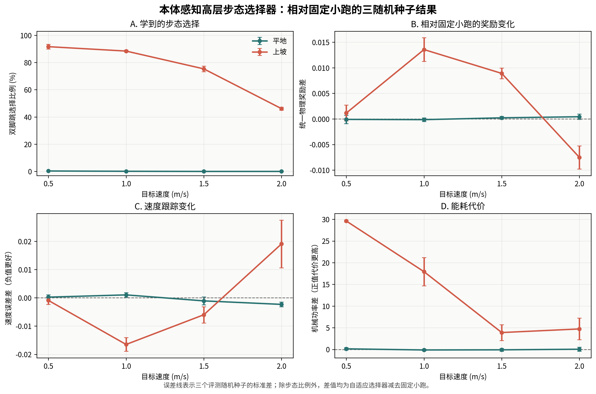

# 基于本体感知历史的 Go2 高层步态自适应

本项目在冻结的 Walk These Ways（WTW）Go2 底层运动策略之上增加高层控制器，
研究机器人能否只依靠目标速度和本体感知历史，自主选择步态并调整连续步态参数。

项目的目标不是人为制造更多步态，而是回答：

> 与固定小跑相比，状态相关的高层步态决策能否在统一物理评价下，带来可重复的
> 速度跟踪、稳定性、接触安全或能耗改善？

## 当前状态

当前已经得到一个局部有效、但边界明确的仿真原型：

- 部署侧输入只有目标前进速度和十帧本体感知历史；
- 不向策略输入任务编号、地形编号、目标步态标签、相机或雷达；
- 平地和上坡使用同一套物理奖励；
- 平地上策略几乎始终选择小跑，表现与固定小跑基本相同；
- 中速上坡上策略会较多选择同步跳步态；
- 中速上坡相对固定小跑改善了综合得分、速度误差、接触滑移和冲击；
- 改善伴随更高机械功率；
- 高速上坡和多数未见地形没有建立稳定优势；
- 三种连续参数网络均未取得超过仿真波动的可重复收益；
- 尚未完成仿真到实机迁移。

因此，本项目目前不能声称完成了全地形步态自适应。更准确的结论是：

```text
仅依赖目标速度与本体感知历史，高层策略可以在平地和上坡之间形成条件与速度
相关的步态选择；该选择在部分中速上坡条件下改善跟踪和接触安全，但增加能耗，
且收益尚不能推广到高速上坡和所有未见地形。
```

## 系统结构

```text
目标速度 + 十帧本体感知历史
               |
               v
学生历史编码器：估计当前环境和动力学状态
               |
               +------> 预测通用物理状态
               |
               v
高层步态选择器：同步跳 / 小跑 / 跳跃 / 踱步
               |
               +------> 可选的五个连续参数修正
               |
               v
冻结的 WTW Go2 底层策略
               |
               v
十二个关节动作
```

训练时，教师编码器可以读取仿真提供的 14 维通用物理量，包括地形高度统计、
摩擦、负载、质心偏移、推扰状态、身体高度和姿态。部署时不使用教师，只保留
从本体历史推断状态的学生网络。

高层输出包括四种步态：

| 英文名称 | 中文说明 |
|---|---|
| `pronking` | 四足近似同步的跳跃步态 |
| `trotting` | 对角腿交替的小跑步态 |
| `bounding` | 前后腿组交替的跳跃步态 |
| `pacing` | 同侧腿交替的踱步步态 |

以及五个连续参数：

```text
步频、触地时长、抬脚高度、站立宽度、身体俯仰
```

## 统一物理评价

所有训练场景使用同一套奖励公式，不根据地形编号切换奖励权重。当前评价包含：

- 目标速度跟踪和存活；
- 身体姿态与角速度；
- 横向漂移和垂直运动；
- 接触期间的足端滑移；
- 触地冲击和摆动期擦碰；
- 关节机械功率；
- 动作变化和连续参数健康状态。

统一规则有助于减少地形特定先验，但并不自动等于绝对公平。指标定义、归一化、
统计窗口和权重仍会影响结果。项目对奖励经历了在线与离线一致性检查、固定配置
检查、公平参数搜索和独立随机种子复核。完整过程见
[`DETAILED_PROJECT_REVIEW_20260723.md`](DETAILED_PROJECT_REVIEW_20260723.md)。

## 核心结果

主结果来自 32 个并行环境、三个独立评测随机种子，并使用相同地图、速度、底层
策略和运行长度，对比：

```text
自适应高层策略
对比
同一模型检查点下强制使用默认小跑
```



目前最可靠的观察是：

- 平地超过 99.6% 使用小跑，没有获得有意义的额外收益；
- 上坡 1.0 和 1.5 m/s 出现较多同步跳；
- 上坡平均综合得分约提高 `0.0041`；
- 上坡平均速度误差约降低 `0.0038`；
- 上坡接触滑移、冲击和擦碰有所降低；
- 上坡机械功率平均增加约 `9.49`；
- 上坡 2.0 m/s 没有改善。

这些结果表示“安全与跟踪改善换取更高能耗”的局部取舍，不代表自适应策略在
所有指标和所有地形上都优于固定小跑。

汇报材料见 [`reports/20260721_closure/`](reports/20260721_closure/)。

## 代码入口

### 推荐阅读的最小实现

[`high_level_minimal/`](high_level_minimal/) 提供不依赖原大型 `scripts/` 的高层
主线实现，包含：

```text
任务分配
环境和底层模型加载
高层步态封装
教师学生网络
PPO 强化学习
两阶段训练
独立评测
可视化和录像
```

从零学习时先读：

[`high_level_minimal/LEARNING_ROADMAP.md`](high_level_minimal/LEARNING_ROADMAP.md)

重要说明：

> 最小实现已经通过语法、依赖、核心数值等价和 CPU 训练更新检查，但尚未完成
> Isaac Gym 短训练验证。当前汇报结果由原 `scripts/` 实验链产生，不能假定
> 最小实现已经复现了相同数值结果。

### 历史实验实现

`scripts/` 保留完整实验演化、奖励审查、成对评测、信息通路诊断和历史兼容功能。
它适合追溯结果，但不建议作为第一次阅读项目的入口。

## 环境要求

本地实验使用过的主要环境为：

```text
Ubuntu
Python 3.8
NVIDIA GPU
Isaac Gym Preview 4
PyTorch 2.4.1 + CUDA 12.1
NumPy 1.23.5
```

Isaac Gym 和 PyTorch 需要根据本机驱动单独安装。项目的基础 Python 依赖可通过：

```bash
cd walk-these-ways-go2-main
pip install -e .
```

验证环境：

```bash
python -c "import numpy, torch; print(numpy.__version__, torch.__version__)"
python -c "import isaacgym; print('Isaac Gym import OK')"
```

由于 `runs/` 不上传 GitHub，仓库不包含训练输出和完整模型检查点。运行高层训练前，
需要先训练或取得兼容的 WTW Go2 底层模型，并放到：

```text
runs/gait-conditioned-agility/pretrain-go2/train/<run-id>/
```

其中至少应包含：

```text
parameters.pkl
checkpoints/body_latest.jit
checkpoints/adaptation_module_latest.jit
```

## 最小主线用法

以下命令都从项目根目录执行。

### 第一阶段：只训练步态选择

```bash
PYTHONPATH=$PWD python3 -m high_level_minimal.train \
  --run-name minimal_gait_stage \
  --stage gait \
  --decision-interval 5 \
  --iterations 50
```

连续参数在这一阶段固定为默认值，避免随机参数探索干扰步态选择。

### 第二阶段：小范围调整连续参数

```bash
PYTHONPATH=$PWD python3 -m high_level_minimal.train \
  --run-name minimal_parameter_stage \
  --stage parameters \
  --init-checkpoint runs/high_level_oracle_gait/minimal_gait_stage/checkpoints/high_level_final.pt \
  --decision-interval 5 \
  --iterations 30
```

第二阶段冻结步态选择、教师、学生和物理状态预测，只允许连续参数网络在默认模板
附近调整。当前实验尚未证明该阶段能稳定提高性能。

### 独立评测

```bash
PYTHONPATH=$PWD python3 -m high_level_minimal.evaluate \
  --run-dir runs/high_level_oracle_gait/minimal_gait_stage \
  --eval flat_trot_efficiency:1.0,ramp_up_trot_robustness:1.0
```

固定小跑对照：

```bash
PYTHONPATH=$PWD python3 -m high_level_minimal.evaluate \
  --run-dir runs/high_level_oracle_gait/minimal_gait_stage \
  --eval flat_trot_efficiency:1.0,ramp_up_trot_robustness:1.0 \
  --force-gait trotting
```

完整参数说明见
[`high_level_minimal/README.md`](high_level_minimal/README.md)。

## 仓库结构

```text
high_level_minimal/   当前高层主线的可读最小实现
scripts/              历史训练、诊断和评测工具
go2_gym/              Go2 仿真环境、奖励和基础封装
go2_gym_learn/        底层强化学习基础设施
go2_gym_deploy/       Go2 实机部署与 Unitree SDK2 接口
resources/            机器人、地形和纹理资源
reports/              精选汇报图、说明和视频
runs/                 本地训练输出，不上传 GitHub
logs/                 本地底层训练日志，不上传 GitHub
```

## 已知局限

- 当前可靠证据主要来自平地和上坡；
- 未证明所有合理场景都需要离散步态切换；
- 连续参数自适应尚无稳定收益；
- 只有一个主要训练随机种子的完整结论；
- GPU PhysX 不是严格确定性的；
- 精选视频用于展示场景，不能代替多环境统计结果；
- 奖励是一套经过审查的候选物理定义，而不是普遍真值；
- 尚未完成延迟、噪声、传感器偏差和真实机器人验证。

## 安全提示

实机部署会直接向机器人发送低层关节命令。首次测试必须将机器人吊起或放置在
安全支架上，准备随时切换阻尼模式，并确认网络接口、关节顺序、控制频率和急停
逻辑。研究代码按现状提供，使用者需自行承担硬件风险。

## 上游项目与许可证

本项目基于：

- [walk-these-ways](https://github.com/Improbable-AI/walk-these-ways)
- [walk-these-ways-go2](https://github.com/Teddy-Liao/walk-these-ways-go2)
- [legged_gym](https://github.com/leggedrobotics/legged_gym)
- [rsl_rl](https://github.com/leggedrobotics/rsl_rl)
- [Unitree SDK2](https://github.com/unitreerobotics/unitree_sdk2)

请同时遵守根目录 `LICENSE`、`LICENSES/` 以及各第三方目录中的许可证。
